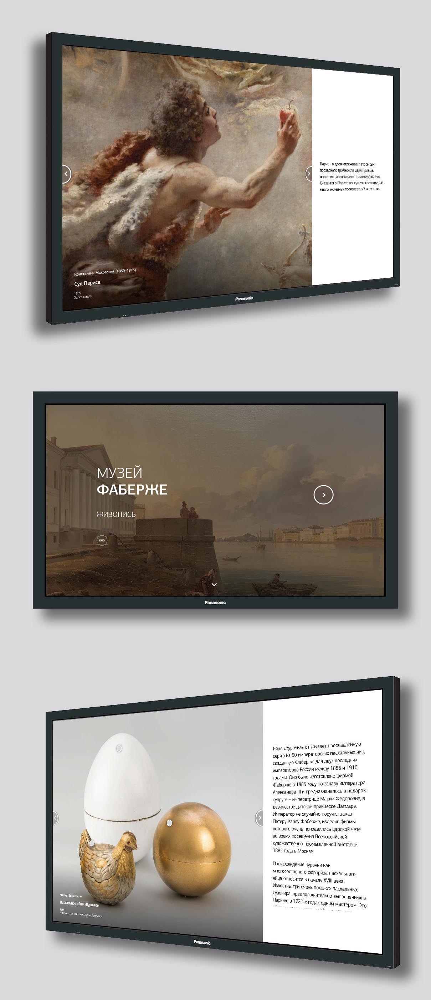

**Faberge Museum Drawings**

[Drawings Viewer Display](https://bessondi.github.io/Faberge-Drawings/)

The purpose of this project was to create a web application for the TV touchscreen with which museum visitors can interact. The web application consists of two sections: a section with paintings and a section with imperial Easter masterpieces.

